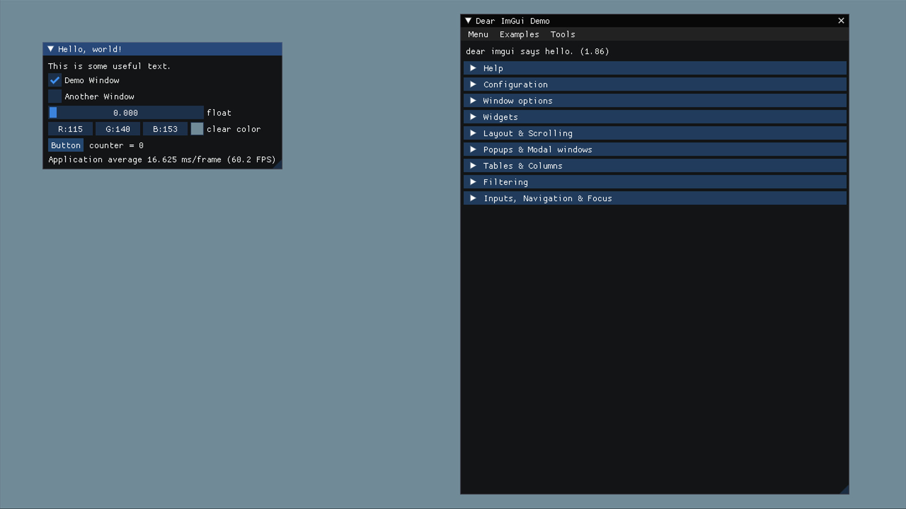

# imgui-xbox360

Custom Dear ImGui backends for the Xbox 360.

> [!WARNING]
> These backends only support Dear ImGui up to [v1.86](https://github.com/ocornut/imgui/tree/v1.86), this is because v1.87 [removed support for pre C++11 compiler and VS2010](https://github.com/ocornut/imgui/releases/tag/v1.87).

## How to compile Dear ImGui for the Xbox 360?

-   Make sure you're using v1.86 of Dear ImGui.
-   Define the `IMGUI_DISABLE_WIN32_FUNCTIONS` macro, so that Dear ImGui doesn't try to include `Windows.h` nor use the clipboard APIs which aren't available on Xbox 360.
-   Disable the `C4127` compiler warning, this is only required if `WarningLevel` is set to `Level4` and if `TreatWarningAsError` is set to `true`.

## How to use the backends?

Simply copy [`imgui_impl_dx9.h`](./imgui_impl_dx9.h), [`imgui_impl_dx9.cpp`](./imgui_impl_dx9.cpp), [`imgui_impl_xbox360.h`](./imgui_impl_xbox360.h) and [`imgui_impl_xbox360.cpp`](./imgui_impl_xbox360.cpp) into your project, and refer to the [example app](./example/main.cpp) to see how to use them.

## Key differences from the standard Dear ImGui backends

### Xbox 360 compared to Win32

-   The mouse related functions were not ported to Xbox 360 because it doesn't support mice.
-   The `ImGui_ImplWin32_WndProcHandler` wasn't ported because the Xbox 360 has no concept of windows.
-   The logic for dynamically loading the XInput DLL was removed because XInput is implemented in the `xam.xex` module, which is always loaded on the system.
-   Since the Xbox 360 doesn't have a `WndProcHandler`, keyboard events are handled just like the gamepad, by checking the keyboard state every frame.
-   The shutdown logic was removed because it was just unloading the XInput DLL, which this backend doesn't load.
-   Because the Xbox 360 doesn't have windows, `ImGuiIO::DisplaySize` was hard-coded to the display definition of the system, which is always 720p (other definitions are created by the hardware scaler).

### DirectX 9 for Xbox 360 compared to DirectX 9 for Win32

-   The biggest difference is that the standard backend uses the fixed-function pipeline, which isn't supported on Xbox 360. It means this backend uses a vertex shader and a pixel shader instead.
-   No need to set a `D3DVIEWPORT9` on the `D3DDevice` because the Xbox 360 doesn't have windows, so the viewport is always the whole screen.
-   When calling `CreateVertexBuffer` and `CreateIndexBuffer`, `D3DUSAGE_DYNAMIC` was removed because it isn't supported on Xbox 360.
-   FVF vertex buffers aren't supported so this backend uses a `D3DVertexDeclaration` instead.
-   The font texture has the `D3DFMT_LIN_A8R8G8B8` format, which doesn't exist on Windows. This is because, by default, texture data is stored following a tiled layout on Xbox 360. Using the `_LIN_` variant allows you to write texture data linearly, the same way you would on Windows.
-   `D3DVertexBuffer::Lock` and `D3DIndexBuffer::Lock` don't actually lock the buffers on Xbox 360. These functions are still implemented but purely for portability with Windows. When linking against `d3d9d.lib` in debug mode, a breakpoint is triggered if anything other than `0` is passed to the `OffsetToLock` and `SizeToLock` arguments of these functions.
-   The shutdown logic was removed because only one user process can run at a time, and the DirectX resources are automatically cleaned up by the system when switching games.

### Main setup and rendering

-   Everything related to managing a window and messages was removed, because the Xbox 360 doesn't have those concepts.
-   On Xbox 360, `D3DDevice::BeginScene` and `D3DDevice::EndScene` are deprecated and do nothing, so they were omitted.

## Note about shaders

The shader source codes are included as raw strings in the DirectX 9 backend code and compiled at runtime. This is for simplicity sake, mainly to avoid having them in separate files with custom build steps to compile them and deploy the byte code to the console. In your app, feel free to change the DirectX 9 backend to do this the "proper" way and compile the shaders during a build step.
